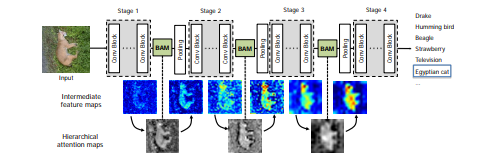
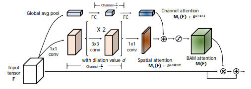

## BAM: Bottleneck Attention Module in PyTorch
PyTorch implementation of [BAM: Bottleneck Attention Module](https://arxiv.org/abs/1807.06514), Jongchan Park, Sanghyun Woo, Joon-Young Lee, In So Kweon (BMVC18).

 

